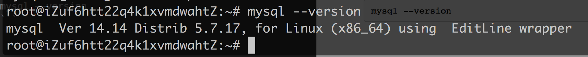
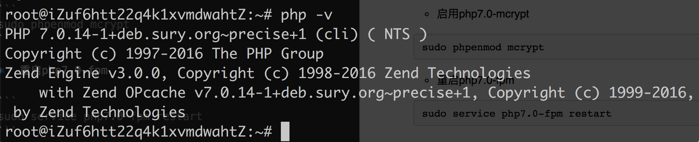

### ubuntu12.04 Nginx1.10 + PHP7 + Nodejs7 + Laravel环境安装

####1.换源
先下载个vim编辑器

```
sudo apt-get install vim
```
然后备份一份官方的源文件

```
sudo cp /etc/apt/sources.list /etc/apt/sources.list.bak 
```

开始换源

```
sudo vim /etc/apt/sources.list
```
然后把下面一段复制进去覆盖原来的

```
deb http://mirrors.aliyun.com/ubuntu/ trusty main restricted universe multiverse
deb http://mirrors.aliyun.com/ubuntu/ trusty-security main restricted universe multiverse
deb http://mirrors.aliyun.com/ubuntu/ trusty-updates main restricted universe multiverse
deb http://mirrors.aliyun.com/ubuntu/ trusty-proposed main restricted universe multiverse
deb http://mirrors.aliyun.com/ubuntu/ trusty-backports main restricted universe multiverse
deb-src http://mirrors.aliyun.com/ubuntu/ trusty main restricted universe multiverse
deb-src http://mirrors.aliyun.com/ubuntu/ trusty-security main restricted universe multiverse
deb-src http://mirrors.aliyun.com/ubuntu/ trusty-updates main restricted universe multiverse
deb-src http://mirrors.aliyun.com/ubuntu/ trusty-proposed main restricted universe multiverse
deb-src http://mirrors.aliyun.com/ubuntu/ trusty-backports main restricted universe multiverse
```
更新列表

```
sudo apt-get update 
```

###2. 环境安装(都以最新的版本为准,当下小白属)
* 安装nginx

	```
	sudo apt-get install nginx
	```
	上面的命令安装的貌似是1.0还是1.1,接下来更新到1.10
	
	把下面两个源添加到源文件里面,当然你也可以vim 编辑,不过下面方式方便
	
	```
	echo deb http://nginx.org/packages/ubuntu/ trusty nginx >> /etc/apt/sources.list
echo deb-src http://nginx.org/packages/ubuntu/ trusty nginx >> /etc/apt/sources.list
	```
	更新并导入升级Key,ubuntu会自带wget工具
	
	```
	wget http://nginx.org/keys/nginx_signing.key && apt-key add nginx_signing.key && apt-get update && apt-get install nginx
	```
	
	在使用ppa更新Nginx版本之前得装下面两个东西
	
	```
	apt-get install software-properties-common
	apt-get install python-software-properties
	```
	接着
	
	升级
	
	```
	add-apt-repository ppa:nginx/stable && apt-get update && apt-get upgrade
	```
	
	新安装:
	
	```
	add-apt-repository ppa:nginx/stable && apt-get update && apt-get install nginx
	```
	
	
	
*	安装Mysql5.7(最喜欢的一个新特性是可以存储json格式)

	下面默认是安装的5.5的版本
	
	```
	sudo apt-get install mysql-server
	```
	这步才做会要你输入你的数据库密码,完了点ok就行
	
	接着,运行包含的安全和数据库初始化脚本
	
	```
	sudo mysql_secure_installation
	sudo mysql_install_db
	```
	
	**install mysql5.7,其实上面步骤可以省略,如果你只想用5.7版本的话**
	
	如果要安装MySQL 5.7，您需要从MySQL APT存储库页面添加较新的APT软件包存储库
	
	```
	wget http://dev.mysql.com/get/mysql-apt-config_0.6.0-1_all.deb
	```
	
	下一步,使用dpkg运行它
	
	```
	sudo dpkg -i mysql-apt-config_0.6.0-1_all.deb
	```
	
	这一步你会看到一个client环节让你选择5.6或者5.7, 直接选择5.6,选择OK即可
	
	接着更新一下你的列表
	
	```
	sudo apt-get update
	```
	
	然后,安装mysql-server包，现在包含MySQL 5.7
	
	```
	sudo apt-get install mysql-server
	```
	
	最后,您需要运行包含的安全性脚本。这会更改一些较不安全的默认选项，如远程根登录和示例用户
	
	```
	sudo mysql_secure_installation
	```
	
	下面查看一下Mysql版本
	
	```
	mysql --version
	```
	
	如果你使用的MySQL版本早于5.7.6，你应该通过运行mysql_install_db来初始化数据目录

	```
	sudo mysql_install_db
	```
	
	最后,测试一下Mysql有没有运行
	
	```
	service mysql status
	```
	
	game over
	
*	安装PHP7(据说性能提升很大)
	
	添加PPA。PPA，表示 Personal Package Archives，也就是个人软件包集
	
	```
	sudo apt-get install python-software-properties software-properties-common
	sudo add-apt-repository ppa:ondrej/php
	sudo apt-get update
	```
	
	安装PHP7以及所需的一些扩展
	
	```
	sudo apt-get install php7.0-fpm php7.0-cli php7.0-mcrypt php7.0-mysql php7.0-mbstring php7.0-xml
	```
	
	**配置PHP7**
	
	*	打开php.ini配置文件，找到cgi.fix_pathinfo选项，去掉注释，然后将值设置为0 (vim使用“/”进入查找模式)
	
	```
	sudo vim /etc/php/7.0/fpm/php.ini
	```
	修改后wq保存退出
	
	*	启用php7.0-mcrypt

	```
	sudo phpenmod mcrypt
	```
	
	*	重启php7.0-fpm

	```
	sudo service php7.0-fpm restart
	```
	
	* 最后看下PHP版本

	```
	php -v
	```
	
*	Nodejs安装(这个不想写了)
	先下载nvm,
	然后通过nvm可以下载不同版本的Node,多版本可以共存,随时切换,
	google很多教程,可以自己研究,我github上也有写

*	跑Laravel项目,这个写过Laravel应该都知道,没写过的自己研究

	重点就是Composer和修改权限及Composer install, 就完了
	还有就是git.
	
	暂时就这些
	
**Apache安装以上环境在我github上都有写,包括域名配置及虚拟主机配置以及https配置**

**以上记录仅摘抄于网络,仅作记录**

######参考文献
*	[阿里云Ubuntu14+PHP7+Nginx+Mysql环境搭建](http://www.jianshu.com/p/1d312d9f1be1)
* 	[How To Install MySQL on Ubuntu 14.04](https://www.digitalocean.com/community/tutorials/how-to-install-mysql-on-ubuntu-14-04)
	